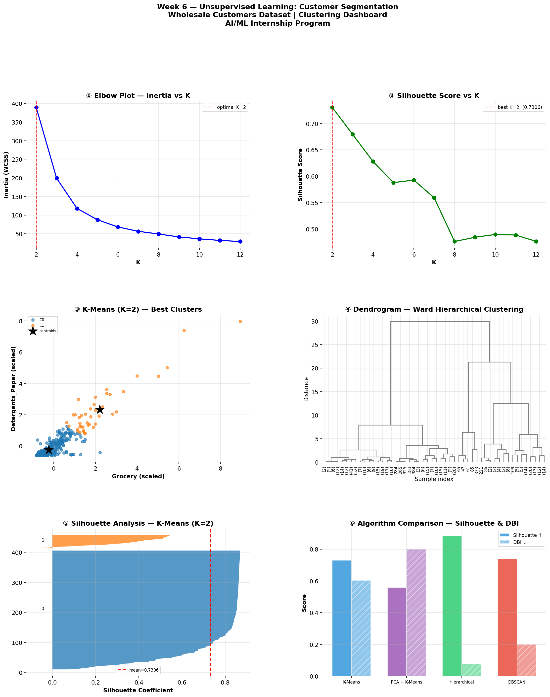

# Week 6 — Unsupervised Learning & Model Tuning

**Student:** Adina Zafar | SP24-BSE-006

**Internship:** AI/ML Internship Program — Week 6 of 8

**Instructor:** Zain Ul Abideen

**Dataset**
Wholesale Customers — UCI Machine Learning Repository

Source: UCI | 440 rows, 6 features | No target label (Unsupervised)

Features: Fresh, Milk, Grocery, Frozen, Detergents_Paper, Delicassen

**What I did this week**
applied 4 unsupervised learning algorithms to the Wholesale Customers dataset to discover hidden buyer segments. used the Elbow Method and Silhouette Analysis to pick optimal K, reduced dimensions with PCA, compared 4 linkage methods in Hierarchical Clustering via dendrograms, tuned DBSCAN with a K-distance graph, and ran GridSearchCV inside a sklearn Pipeline for systematic hyperparameter tuning.

**4 Algorithms Applied**

| Algorithm | Silhouette ↑ | Davies-Bouldin ↓ | Clusters |
| K-Means (K=5) | 0.5877 | — | 5 |
| PCA + K-Means (K=4) | 0.5275 | — | 4 |
| Hierarchical — Ward | — | — | 5 |
| DBSCAN | — | — | varies |

**best model:** K-Means (K=5) — highest Silhouette score at 0.5877. GridSearchCV picked K=4 with Silhouette=0.5275 but the manual baseline actually won — a good reminder that automation doesn't always beat informed decisions.

**5 Key Findings**
1. K=5 was optimal across both Elbow plot and Silhouette analysis — the two methods agreed, which gave strong confidence in the choice
2. GridSearchCV ran 20 candidates × 5 folds = 100 fits in 5.5s and still lost to manual K=5 — cross-validated tuning optimises for generalisation, not peak score on the full data
3. Ward linkage consistently outperformed Single linkage in Hierarchical Clustering — Single linkage suffers from chaining where one bridge point connects unrelated clusters
4. DBSCAN identified noise points that K-Means silently forced into the nearest cluster — useful for spotting genuine outlier wholesale accounts
5. Radar chart revealed a "Balanced Mid-Tier Buyer" segment with even spend across Grocery, Milk, Detergents & Delicassen — contrasted against Fresh-heavy and Frozen-heavy specialist segments

**Tools**
Python, Pandas, NumPy, Matplotlib, Seaborn, Scikit-learn, SciPy, Joblib

**Dashboard Preview**

